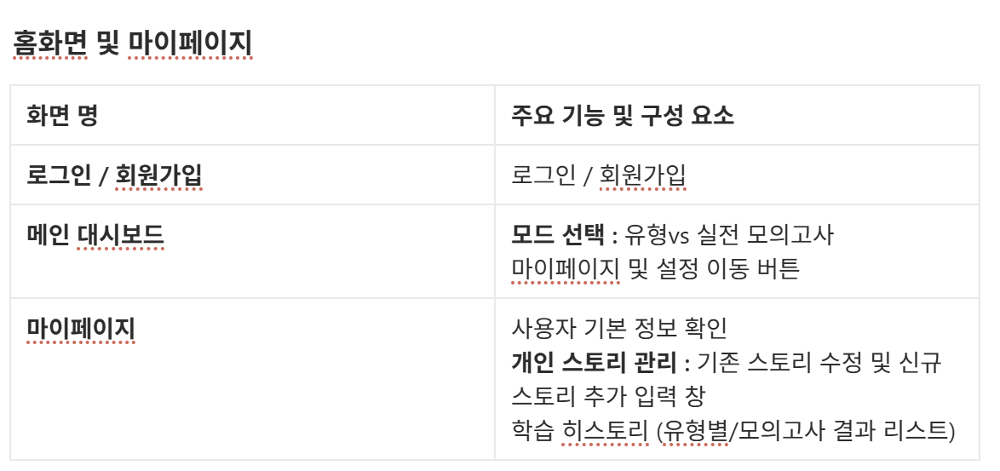
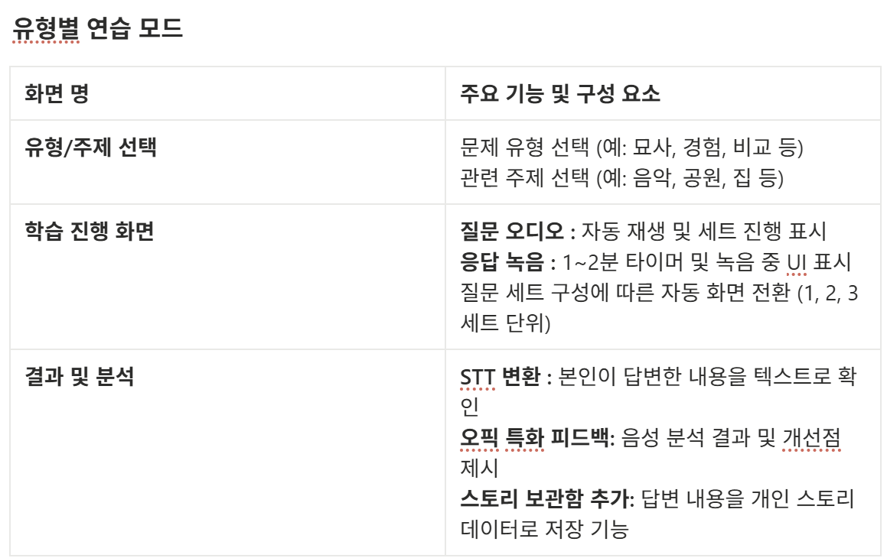
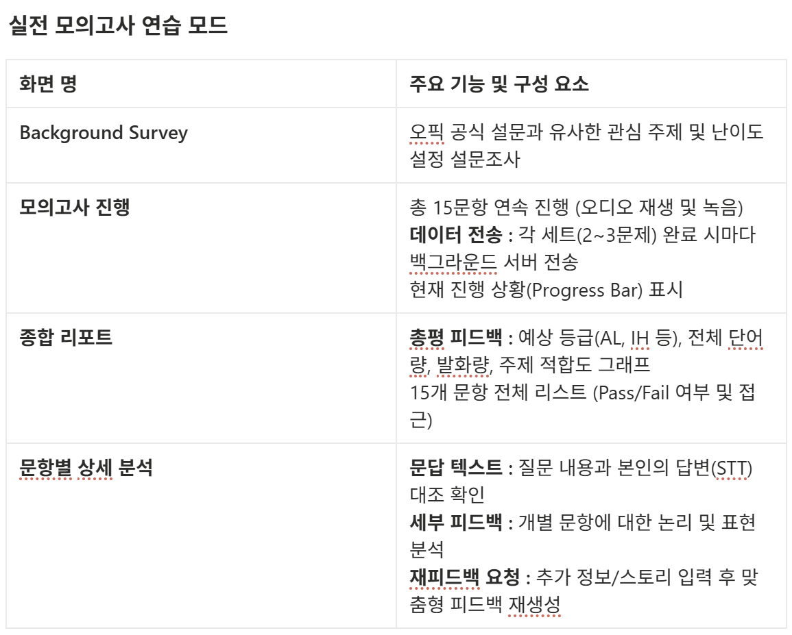

## 2026.01.14

### 1. 프로젝트 기획 구체화 회의 (2/2)

주제 선정 : OPIc 시험 준비를 도와주는 AI 튜터 서비스

1)~3) 0113에 진행

4) 기능 정의

**공통 - 회원 관리 및 정보수정**

- 사용자는 ‘**소셜로그인**’ 또는 ‘일반계정’을 통해 회원가입 및 로그인을 할 수 있다.
- 회원가입 시에는 이메일 이외에 개인 정보는 받지 않으며, 개인 스토리 입력은 필수가 아니다.
- 사용자는 마이페이지에서 자신의 개인 스토리를 추가로 작성할 수 있다.
- 사용자는 메인페이지에서 ‘유형별 모드’와 ‘모의고사 모드’를 선택해서 시작할 수 있다
- 사용자는 처음 서비스 접속 시, 서비스에 대한 튜토리얼이 진행된다. (후순위)

**설문조사**

- 유저의 인적사항 및 정보를 입력받음
- 문제 유형을 입력 받고 저장함

**유형별 모드** - 자기소개 / 묘사하기,설명하기 / 롤플레이 / 비교하기, 최근 뉴스 (中 택 1)

- 사용자는 문제 유형과 관련된 주제를 선택할 수 있다.
(처음 1회에는 초기화 상태, 이후에는 저장된 주제를 디폴트로 나오고 수정할 경우 수정 가능)
    - 설문한 이력이 없는 경우, “설문 하지 않으셨습니다.”라고 하고 설문 페이지로 이동하기
    - 설문한 이력이 있는 경우, 이전에 선택한 설문 내용을 수정하시겠습니까?
    → 수정할거면 ‘수정’버튼 클릭해서 설문 페이지로 이동해서 수정
    → 수정안할거면 그대로 ‘다음’ 버튼 클릭해서 모의고사 시작
- 사용자는 연습하고자 하는 문제 유형을 선택할 수 있다. (불러오기 가능)
- 사용자는 *선택한 10개의 주제와 돌발 주제*의 버튼을 클릭할 수 있고,
클릭한 주제에 대해서 선택한 유형의 문제 세트가 음성으로 제공된다. (영어 듣기)
- 사용자는 질문을 알아듣지 못했을 경우, ‘질문 보기’버튼으로 질문을 텍스트로 확인할 수 있다.
- 사용자는 질문 음성이 끝나면, 자유롭게 1-2분 사이로 응답할 수 있다.
- 질문 세트(2문제 혹은 3문제)가 끝나면, 사용자의 응답 내용이 STT로 변환되어 화면에 표시된다.
- 음성 녹음 파일과 STT내용을 오픽 시험에 특화되게 분석한 피드백 결과를 받아볼 수 있다.
- 사용자는 해당 문제에 대해서 자신의 스토리&정보를 추가로 입력할 수 있고, 이는 사용자의 개인스토리 데이터에 누적되어 저장된다.

**유형별 피드백**

- 객관적 피드백
    - 문장의 완성도
    - 시제 적합도
    - 문법 적합도
    - 문장의 논리성
    - 주제 적합도
    
    ---
    
    - 발화량
    - 어휘량(형용사, 부사 등)
    - 문장의 구조
- 비언적인 피드백
    - 자연스러움 정도(얼마나 원어민스러운가) - ex) 쿠션어 사용
    - 자신감?

**실전 모의고사** - 1번부터 15번까지 유형별 모든 질문 진행

- 모의고사 시작 전, 사용자는 문제 유형과 관련된 주제를 선택할 수 있다. 
(처음 1회에는 초기화 상태, 이후에는 저장된 주제를 디폴트로 나오고 수정할 경우 수정 가능)
    - 설문한 이력이 없는 경우, “설문 하지 않으셨습니다.”라고 하고 설문 페이지로 이동하기
    - 설문한 이력이 있는 경우, 이전에 선택한 설문 내용을 수정하시겠습니까? 
    → 수정할거면 ‘수정’버튼 클릭해서 설문 페이지로 이동해서 수정
    → 수정안할거면 그대로 ‘다음’ 버튼 클릭해서 모의고사 시작
- 사용자가 선택한 주제에 대해서 모의고사 세트의 15개 질문 음성 차례대로 나온다.
- 각 질문 음성이 끝날 때마다 사용자는 자유롭게 1-2분 사이로 응답할 수 있다.
- 질문 1세트(3문제 또는 2문제)가 끝날 때마다 응답 음성 데이터를 서버로 전송된다.

**모의고사 피드백**

- 모든 질문과 질문에 대한 응답이 끝난 뒤, 모의고사에 대한 피드백 결과를 받아볼 수 있다.
    - 예상 점수
    - 총평
    - 보완할 부분 (ex. 어휘력, 문장구조개선..)
    
    ---
    
    - 전체적인 단어량
    - 발화량
- 모의고사의 개별 문항 당 질문과 질문에 대한 사용자의 응답을 확인할 수 있다.
    - 본인 응답의 텍스트 및 음성으로 확인 가능
- 모의고사의 개별 문항에 대한 세부적인 피드백을 받아볼 수 있다. (유형별 피드백과 동일)
- 모의고사의 개별 문항에 대한 추가적인 정보를 입력해, 해당 정보를 기반으로 추가 피드백을 받을 수 있다.

5) 화면 단위 / 기능 단위 쪼개기

- 피그마 활용 화면 단위 기능 정의 및 와이어 프레임 설계(ing)

  
      
      
      

### 2. 코딩테스트 스터디
- 2문제 1.5시간 내에 풀이
