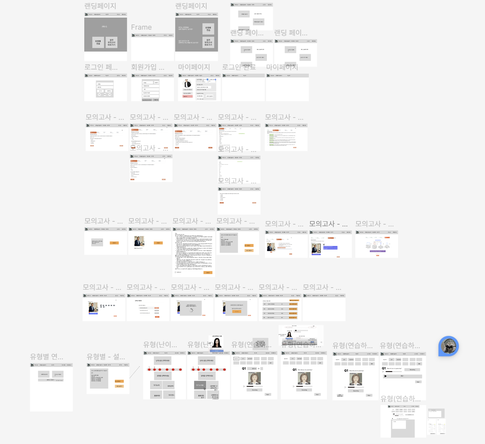
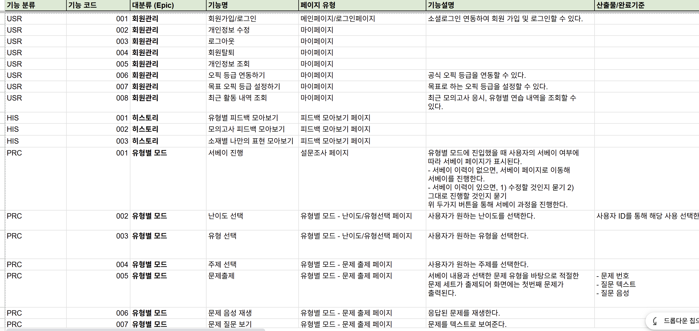

## 2026.01.15

### 1. 프로젝트 화면 설계 및 기능 상세 요구사항 정의

주제 선정 : OPIc 시험 준비를 도와주는 AI 튜터 서비스

5) 화면 단위 / 기능 단위 쪼개기

- 유형별 모드 연습하기 기능에 대해서 화면 설계 진행
- 유형별 모드 연습하기 기능에 대한 상세 요구사항 정의
- 이외에 회원관리, 모의고사, 피드백 기능에 대해 팀원들과 취합하여 상호 조정하는 회의 진행

**<결과물>**

와이어 프레임 설계(Figma)

기능 정의(Sheets)

### 2. 컨설턴트 미팅
- 기획 전반에 대한 점검
- 기술적인 구현에 대한 방안 논의

### 3. 코딩테스트 스터디
- 2문제 1.5시간 내에 풀이
